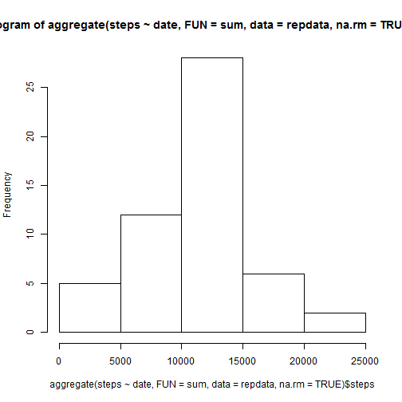
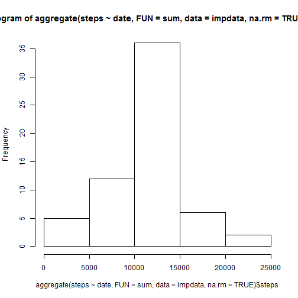

# Reproducible Research: Peer Assessment 1


## Loading and preprocessing the data
This assumes that the file has already been downloaded and present in the current working directory
Now unzip it

```r
unzip("repdata.zip")
```

And read the data and convert the strings in the "date" variable to date

```r
repdata <- read.csv("activity.csv", stringsAsFactors = FALSE)
repdata$date <- as.Date(repdata$date, "%Y-%m-%d")
```

## What is mean total number of steps taken per day?
Show the histogram of daily number of steps

```r
hist(aggregate(steps ~ date, FUN = sum, data = repdata, na.rm = TRUE)$steps)
```

 

And calculate the mean and median

```r
aggregate(steps ~ date, FUN = mean, data = repdata, na.rm = TRUE)
```

```
##          date   steps
## 1  2012-10-02  0.4375
## 2  2012-10-03 39.4167
## 3  2012-10-04 42.0694
## 4  2012-10-05 46.1597
## 5  2012-10-06 53.5417
## 6  2012-10-07 38.2465
## 7  2012-10-09 44.4826
## 8  2012-10-10 34.3750
## 9  2012-10-11 35.7778
## 10 2012-10-12 60.3542
## 11 2012-10-13 43.1458
## 12 2012-10-14 52.4236
## 13 2012-10-15 35.2049
## 14 2012-10-16 52.3750
## 15 2012-10-17 46.7083
## 16 2012-10-18 34.9167
## 17 2012-10-19 41.0729
## 18 2012-10-20 36.0938
## 19 2012-10-21 30.6285
## 20 2012-10-22 46.7361
## 21 2012-10-23 30.9653
## 22 2012-10-24 29.0104
## 23 2012-10-25  8.6528
## 24 2012-10-26 23.5347
## 25 2012-10-27 35.1354
## 26 2012-10-28 39.7847
## 27 2012-10-29 17.4236
## 28 2012-10-30 34.0938
## 29 2012-10-31 53.5208
## 30 2012-11-02 36.8056
## 31 2012-11-03 36.7049
## 32 2012-11-05 36.2465
## 33 2012-11-06 28.9375
## 34 2012-11-07 44.7326
## 35 2012-11-08 11.1771
## 36 2012-11-11 43.7778
## 37 2012-11-12 37.3785
## 38 2012-11-13 25.4722
## 39 2012-11-15  0.1424
## 40 2012-11-16 18.8924
## 41 2012-11-17 49.7882
## 42 2012-11-18 52.4653
## 43 2012-11-19 30.6979
## 44 2012-11-20 15.5278
## 45 2012-11-21 44.3993
## 46 2012-11-22 70.9271
## 47 2012-11-23 73.5903
## 48 2012-11-24 50.2708
## 49 2012-11-25 41.0903
## 50 2012-11-26 38.7569
## 51 2012-11-27 47.3819
## 52 2012-11-28 35.3576
## 53 2012-11-29 24.4688
```

```r
aggregate(steps ~ date, FUN = median, data = repdata, na.rm = TRUE)
```

```
##          date steps
## 1  2012-10-02     0
## 2  2012-10-03     0
## 3  2012-10-04     0
## 4  2012-10-05     0
## 5  2012-10-06     0
## 6  2012-10-07     0
## 7  2012-10-09     0
## 8  2012-10-10     0
## 9  2012-10-11     0
## 10 2012-10-12     0
## 11 2012-10-13     0
## 12 2012-10-14     0
## 13 2012-10-15     0
## 14 2012-10-16     0
## 15 2012-10-17     0
## 16 2012-10-18     0
## 17 2012-10-19     0
## 18 2012-10-20     0
## 19 2012-10-21     0
## 20 2012-10-22     0
## 21 2012-10-23     0
## 22 2012-10-24     0
## 23 2012-10-25     0
## 24 2012-10-26     0
## 25 2012-10-27     0
## 26 2012-10-28     0
## 27 2012-10-29     0
## 28 2012-10-30     0
## 29 2012-10-31     0
## 30 2012-11-02     0
## 31 2012-11-03     0
## 32 2012-11-05     0
## 33 2012-11-06     0
## 34 2012-11-07     0
## 35 2012-11-08     0
## 36 2012-11-11     0
## 37 2012-11-12     0
## 38 2012-11-13     0
## 39 2012-11-15     0
## 40 2012-11-16     0
## 41 2012-11-17     0
## 42 2012-11-18     0
## 43 2012-11-19     0
## 44 2012-11-20     0
## 45 2012-11-21     0
## 46 2012-11-22     0
## 47 2012-11-23     0
## 48 2012-11-24     0
## 49 2012-11-25     0
## 50 2012-11-26     0
## 51 2012-11-27     0
## 52 2012-11-28     0
## 53 2012-11-29     0
```

## What is the average daily activity pattern?
Make a time series line plot

```r
plot(aggregate(steps ~ interval, FUN = mean, data = repdata, na.rm = TRUE), 
    type = "l")
```

 

And show which interval has the maximum number of steps - it turns out to be interval 835

```r
temp.data <- aggregate(steps ~ interval, FUN = mean, data = repdata, na.rm = TRUE)
temp.data[which.max(temp.data$steps), ]
```

```
##     interval steps
## 104      835 206.2
```

## Imputing missing values
Report the number of missing values in the data set - there seem to be 2304 NAs

```r
sum(is.na(repdata$steps))
```

```
## [1] 2304
```

For the missing data imputation, I will use interval averages, because there are 8 dates with all NAs, but all intervals have 53 observations

```r
aggregate(!is.na(steps) ~ date, FUN = sum, data = repdata)
```

```
##          date !is.na(steps)
## 1  2012-10-01             0
## 2  2012-10-02           288
## 3  2012-10-03           288
## 4  2012-10-04           288
## 5  2012-10-05           288
## 6  2012-10-06           288
## 7  2012-10-07           288
## 8  2012-10-08             0
## 9  2012-10-09           288
## 10 2012-10-10           288
## 11 2012-10-11           288
## 12 2012-10-12           288
## 13 2012-10-13           288
## 14 2012-10-14           288
## 15 2012-10-15           288
## 16 2012-10-16           288
## 17 2012-10-17           288
## 18 2012-10-18           288
## 19 2012-10-19           288
## 20 2012-10-20           288
## 21 2012-10-21           288
## 22 2012-10-22           288
## 23 2012-10-23           288
## 24 2012-10-24           288
## 25 2012-10-25           288
## 26 2012-10-26           288
## 27 2012-10-27           288
## 28 2012-10-28           288
## 29 2012-10-29           288
## 30 2012-10-30           288
## 31 2012-10-31           288
## 32 2012-11-01             0
## 33 2012-11-02           288
## 34 2012-11-03           288
## 35 2012-11-04             0
## 36 2012-11-05           288
## 37 2012-11-06           288
## 38 2012-11-07           288
## 39 2012-11-08           288
## 40 2012-11-09             0
## 41 2012-11-10             0
## 42 2012-11-11           288
## 43 2012-11-12           288
## 44 2012-11-13           288
## 45 2012-11-14             0
## 46 2012-11-15           288
## 47 2012-11-16           288
## 48 2012-11-17           288
## 49 2012-11-18           288
## 50 2012-11-19           288
## 51 2012-11-20           288
## 52 2012-11-21           288
## 53 2012-11-22           288
## 54 2012-11-23           288
## 55 2012-11-24           288
## 56 2012-11-25           288
## 57 2012-11-26           288
## 58 2012-11-27           288
## 59 2012-11-28           288
## 60 2012-11-29           288
## 61 2012-11-30             0
```

```r
aggregate(!is.na(steps) ~ interval, FUN = sum, data = repdata)
```

```
##     interval !is.na(steps)
## 1          0            53
## 2          5            53
## 3         10            53
## 4         15            53
## 5         20            53
## 6         25            53
## 7         30            53
## 8         35            53
## 9         40            53
## 10        45            53
## 11        50            53
## 12        55            53
## 13       100            53
## 14       105            53
## 15       110            53
## 16       115            53
## 17       120            53
## 18       125            53
## 19       130            53
## 20       135            53
## 21       140            53
## 22       145            53
## 23       150            53
## 24       155            53
## 25       200            53
## 26       205            53
## 27       210            53
## 28       215            53
## 29       220            53
## 30       225            53
## 31       230            53
## 32       235            53
## 33       240            53
## 34       245            53
## 35       250            53
## 36       255            53
## 37       300            53
## 38       305            53
## 39       310            53
## 40       315            53
## 41       320            53
## 42       325            53
## 43       330            53
## 44       335            53
## 45       340            53
## 46       345            53
## 47       350            53
## 48       355            53
## 49       400            53
## 50       405            53
## 51       410            53
## 52       415            53
## 53       420            53
## 54       425            53
## 55       430            53
## 56       435            53
## 57       440            53
## 58       445            53
## 59       450            53
## 60       455            53
## 61       500            53
## 62       505            53
## 63       510            53
## 64       515            53
## 65       520            53
## 66       525            53
## 67       530            53
## 68       535            53
## 69       540            53
## 70       545            53
## 71       550            53
## 72       555            53
## 73       600            53
## 74       605            53
## 75       610            53
## 76       615            53
## 77       620            53
## 78       625            53
## 79       630            53
## 80       635            53
## 81       640            53
## 82       645            53
## 83       650            53
## 84       655            53
## 85       700            53
## 86       705            53
## 87       710            53
## 88       715            53
## 89       720            53
## 90       725            53
## 91       730            53
## 92       735            53
## 93       740            53
## 94       745            53
## 95       750            53
## 96       755            53
## 97       800            53
## 98       805            53
## 99       810            53
## 100      815            53
## 101      820            53
## 102      825            53
## 103      830            53
## 104      835            53
## 105      840            53
## 106      845            53
## 107      850            53
## 108      855            53
## 109      900            53
## 110      905            53
## 111      910            53
## 112      915            53
## 113      920            53
## 114      925            53
## 115      930            53
## 116      935            53
## 117      940            53
## 118      945            53
## 119      950            53
## 120      955            53
## 121     1000            53
## 122     1005            53
## 123     1010            53
## 124     1015            53
## 125     1020            53
## 126     1025            53
## 127     1030            53
## 128     1035            53
## 129     1040            53
## 130     1045            53
## 131     1050            53
## 132     1055            53
## 133     1100            53
## 134     1105            53
## 135     1110            53
## 136     1115            53
## 137     1120            53
## 138     1125            53
## 139     1130            53
## 140     1135            53
## 141     1140            53
## 142     1145            53
## 143     1150            53
## 144     1155            53
## 145     1200            53
## 146     1205            53
## 147     1210            53
## 148     1215            53
## 149     1220            53
## 150     1225            53
## 151     1230            53
## 152     1235            53
## 153     1240            53
## 154     1245            53
## 155     1250            53
## 156     1255            53
## 157     1300            53
## 158     1305            53
## 159     1310            53
## 160     1315            53
## 161     1320            53
## 162     1325            53
## 163     1330            53
## 164     1335            53
## 165     1340            53
## 166     1345            53
## 167     1350            53
## 168     1355            53
## 169     1400            53
## 170     1405            53
## 171     1410            53
## 172     1415            53
## 173     1420            53
## 174     1425            53
## 175     1430            53
## 176     1435            53
## 177     1440            53
## 178     1445            53
## 179     1450            53
## 180     1455            53
## 181     1500            53
## 182     1505            53
## 183     1510            53
## 184     1515            53
## 185     1520            53
## 186     1525            53
## 187     1530            53
## 188     1535            53
## 189     1540            53
## 190     1545            53
## 191     1550            53
## 192     1555            53
## 193     1600            53
## 194     1605            53
## 195     1610            53
## 196     1615            53
## 197     1620            53
## 198     1625            53
## 199     1630            53
## 200     1635            53
## 201     1640            53
## 202     1645            53
## 203     1650            53
## 204     1655            53
## 205     1700            53
## 206     1705            53
## 207     1710            53
## 208     1715            53
## 209     1720            53
## 210     1725            53
## 211     1730            53
## 212     1735            53
## 213     1740            53
## 214     1745            53
## 215     1750            53
## 216     1755            53
## 217     1800            53
## 218     1805            53
## 219     1810            53
## 220     1815            53
## 221     1820            53
## 222     1825            53
## 223     1830            53
## 224     1835            53
## 225     1840            53
## 226     1845            53
## 227     1850            53
## 228     1855            53
## 229     1900            53
## 230     1905            53
## 231     1910            53
## 232     1915            53
## 233     1920            53
## 234     1925            53
## 235     1930            53
## 236     1935            53
## 237     1940            53
## 238     1945            53
## 239     1950            53
## 240     1955            53
## 241     2000            53
## 242     2005            53
## 243     2010            53
## 244     2015            53
## 245     2020            53
## 246     2025            53
## 247     2030            53
## 248     2035            53
## 249     2040            53
## 250     2045            53
## 251     2050            53
## 252     2055            53
## 253     2100            53
## 254     2105            53
## 255     2110            53
## 256     2115            53
## 257     2120            53
## 258     2125            53
## 259     2130            53
## 260     2135            53
## 261     2140            53
## 262     2145            53
## 263     2150            53
## 264     2155            53
## 265     2200            53
## 266     2205            53
## 267     2210            53
## 268     2215            53
## 269     2220            53
## 270     2225            53
## 271     2230            53
## 272     2235            53
## 273     2240            53
## 274     2245            53
## 275     2250            53
## 276     2255            53
## 277     2300            53
## 278     2305            53
## 279     2310            53
## 280     2315            53
## 281     2320            53
## 282     2325            53
## 283     2330            53
## 284     2335            53
## 285     2340            53
## 286     2345            53
## 287     2350            53
## 288     2355            53
```

The imputation code

```r
intavg <- aggregate(steps ~ interval, FUN = mean, data = repdata, na.rm = TRUE)
rownames(intavg) <- paste0("I", as.character(intavg$interval))
impdata <- repdata
for (i in 1:nrow(repdata)) {
    if (is.na(repdata[i, "steps"])) {
        impdata[i, "steps"] <- intavg[paste0("I", as.character(repdata[i, "interval"])), 
            2]
    }
}
```

And repeat some previous steps after imputation

```r
hist(aggregate(steps ~ date, FUN = sum, data = impdata, na.rm = TRUE)$steps)
```

 

```r
aggregate(steps ~ date, FUN = mean, data = impdata, na.rm = TRUE)
```

```
##          date   steps
## 1  2012-10-01 37.3826
## 2  2012-10-02  0.4375
## 3  2012-10-03 39.4167
## 4  2012-10-04 42.0694
## 5  2012-10-05 46.1597
## 6  2012-10-06 53.5417
## 7  2012-10-07 38.2465
## 8  2012-10-08 37.3826
## 9  2012-10-09 44.4826
## 10 2012-10-10 34.3750
## 11 2012-10-11 35.7778
## 12 2012-10-12 60.3542
## 13 2012-10-13 43.1458
## 14 2012-10-14 52.4236
## 15 2012-10-15 35.2049
## 16 2012-10-16 52.3750
## 17 2012-10-17 46.7083
## 18 2012-10-18 34.9167
## 19 2012-10-19 41.0729
## 20 2012-10-20 36.0938
## 21 2012-10-21 30.6285
## 22 2012-10-22 46.7361
## 23 2012-10-23 30.9653
## 24 2012-10-24 29.0104
## 25 2012-10-25  8.6528
## 26 2012-10-26 23.5347
## 27 2012-10-27 35.1354
## 28 2012-10-28 39.7847
## 29 2012-10-29 17.4236
## 30 2012-10-30 34.0938
## 31 2012-10-31 53.5208
## 32 2012-11-01 37.3826
## 33 2012-11-02 36.8056
## 34 2012-11-03 36.7049
## 35 2012-11-04 37.3826
## 36 2012-11-05 36.2465
## 37 2012-11-06 28.9375
## 38 2012-11-07 44.7326
## 39 2012-11-08 11.1771
## 40 2012-11-09 37.3826
## 41 2012-11-10 37.3826
## 42 2012-11-11 43.7778
## 43 2012-11-12 37.3785
## 44 2012-11-13 25.4722
## 45 2012-11-14 37.3826
## 46 2012-11-15  0.1424
## 47 2012-11-16 18.8924
## 48 2012-11-17 49.7882
## 49 2012-11-18 52.4653
## 50 2012-11-19 30.6979
## 51 2012-11-20 15.5278
## 52 2012-11-21 44.3993
## 53 2012-11-22 70.9271
## 54 2012-11-23 73.5903
## 55 2012-11-24 50.2708
## 56 2012-11-25 41.0903
## 57 2012-11-26 38.7569
## 58 2012-11-27 47.3819
## 59 2012-11-28 35.3576
## 60 2012-11-29 24.4688
## 61 2012-11-30 37.3826
```

```r
aggregate(steps ~ date, FUN = median, data = impdata, na.rm = TRUE)
```

```
##          date steps
## 1  2012-10-01 34.11
## 2  2012-10-02  0.00
## 3  2012-10-03  0.00
## 4  2012-10-04  0.00
## 5  2012-10-05  0.00
## 6  2012-10-06  0.00
## 7  2012-10-07  0.00
## 8  2012-10-08 34.11
## 9  2012-10-09  0.00
## 10 2012-10-10  0.00
## 11 2012-10-11  0.00
## 12 2012-10-12  0.00
## 13 2012-10-13  0.00
## 14 2012-10-14  0.00
## 15 2012-10-15  0.00
## 16 2012-10-16  0.00
## 17 2012-10-17  0.00
## 18 2012-10-18  0.00
## 19 2012-10-19  0.00
## 20 2012-10-20  0.00
## 21 2012-10-21  0.00
## 22 2012-10-22  0.00
## 23 2012-10-23  0.00
## 24 2012-10-24  0.00
## 25 2012-10-25  0.00
## 26 2012-10-26  0.00
## 27 2012-10-27  0.00
## 28 2012-10-28  0.00
## 29 2012-10-29  0.00
## 30 2012-10-30  0.00
## 31 2012-10-31  0.00
## 32 2012-11-01 34.11
## 33 2012-11-02  0.00
## 34 2012-11-03  0.00
## 35 2012-11-04 34.11
## 36 2012-11-05  0.00
## 37 2012-11-06  0.00
## 38 2012-11-07  0.00
## 39 2012-11-08  0.00
## 40 2012-11-09 34.11
## 41 2012-11-10 34.11
## 42 2012-11-11  0.00
## 43 2012-11-12  0.00
## 44 2012-11-13  0.00
## 45 2012-11-14 34.11
## 46 2012-11-15  0.00
## 47 2012-11-16  0.00
## 48 2012-11-17  0.00
## 49 2012-11-18  0.00
## 50 2012-11-19  0.00
## 51 2012-11-20  0.00
## 52 2012-11-21  0.00
## 53 2012-11-22  0.00
## 54 2012-11-23  0.00
## 55 2012-11-24  0.00
## 56 2012-11-25  0.00
## 57 2012-11-26  0.00
## 58 2012-11-27  0.00
## 59 2012-11-28  0.00
## 60 2012-11-29  0.00
## 61 2012-11-30 34.11
```

Those numbers are obviously different - we now have more values
## Are there differences in activity patterns between weekdays and weekends?
Create new factor variable - note that in this case, I used Polish names as this is the default on my system. That is why you might not recognize the week names

```r
impdata$daytype <- weekdays(impdata$date) %in% c("sobota", "niedziela")
impdata$daytype[impdata$daytype] <- "weekend"
impdata$daytype["FALSE" == impdata$daytype] <- "weekday"
impdata$daytype <- as.factor(impdata$daytype)
```

Create the plot

```r
par(mfrow = c(2, 1))
with(impdata["weekend" == impdata$daytype, ], plot(aggregate(steps ~ interval, 
    FUN = mean), type = "l", main = "weekend"))
with(impdata["weekday" == impdata$daytype, ], plot(aggregate(steps ~ interval, 
    FUN = mean), type = "l", main = "weekday"))
```

 

